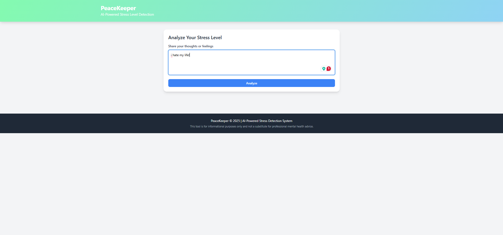
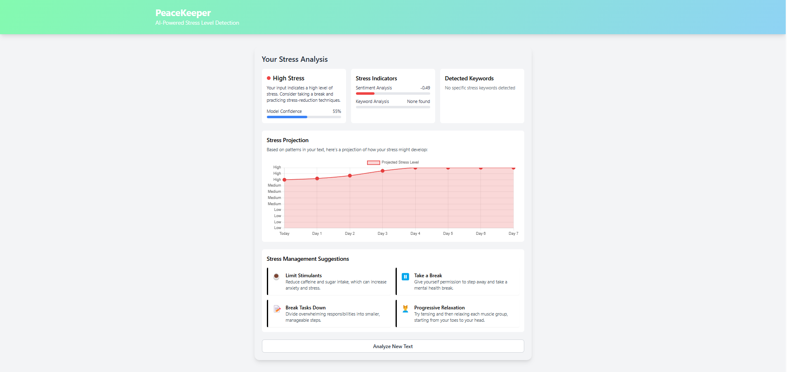

# PeaceKeeper: AI-Powered Stress Detection System

PeaceKeeper is an AI-powered stress detection system that analyzes text input to identify stress levels in users. The system uses natural language processing (NLP) and machine learning techniques to predict whether a user's text indicates low, medium, or high stress levels, and provides personalized suggestions for stress management.

## Features

- **Text Analysis**: Analyze text input to detect stress levels (low, medium, high)
- **Modern UI**: Clean, responsive web interface with real-time feedback
- **Sentiment Analysis**: Extract emotional tone from text using VADER sentiment analysis
- **Keyword Detection**: Identify stress-related keywords and phrases
- **Stress Projection**: Visual projection of potential stress progression over time
- **Personalized Suggestions**: Tailored stress management recommendations based on detected stress level
- **Machine Learning Models**: Neural network models (LSTM, CNN-LSTM, and Transformer)
- **Data Collection**: Tools for gathering stress-related data from various sources
- **Synthetic Data Generation**: Create training data when real data is unavailable

## Screenshots




## System Requirements

- Python 3.8 or higher
- TensorFlow 2.x
- Flask
- NLTK
- Pandas
- NumPy
- Matplotlib
- Modern web browser

## Installation

1. Clone this repository:
   ```
   git clone https://github.com/your-username/peacekeeper.git
   cd peacekeeper
   ```

2. Create a virtual environment and activate it:
   ```
   python -m venv venv
   source venv/bin/activate  # On Windows: venv\Scripts\activate
   ```

3. Install dependencies:
   ```
   pip install -r requirements.txt
   ```

4. Download NLTK resources (first time only):
   ```python
   python -c "import nltk; nltk.download('punkt'); nltk.download('stopwords'); nltk.download('wordnet'); nltk.download('vader_lexicon')"
   ```

## Running the Application

1. Start the Flask web server:
   ```
   python app.py
   ```

2. Open your web browser and navigate to:
   ```
   http://127.0.0.1:5000/
   ```

3. Enter your text in the provided text area and click "Analyze" to receive stress level predictions.

## System Architecture

PeaceKeeper consists of several interconnected components:

1. **Data Collection**: Collects stress-related text from sources like Reddit, Twitter, and surveys
2. **Data Processing**: Cleans and processes text data for model training
3. **Model Training**: Trains neural network models to detect stress levels
4. **Text Analysis**: Analyzes user input using both rule-based and ML techniques
5. **Stress Projection**: Projects potential stress progression based on current levels
6. **Suggestion System**: Provides personalized stress management recommendations
7. **Web Interface**: Provides an intuitive interface for users to interact with the system

## Configuration

The system can be configured through the `config.json` file, which includes settings for:

- Data paths
- Model parameters 
- Training hyperparameters
- Stress level thresholds

## Model Training

To train a new model with your own data:

```
python main.py --generate --preprocess --train
```

This will generate synthetic data, preprocess it, and train a new model.

## Testing

To evaluate model performance:

```
python test_model.py
```

This will test the model against a test dataset and generate performance visualizations.

## Analyzing Text Samples

To analyze sample texts:

```
python main.py --analyze
```

Or to analyze a specific text:

```
python main.py --text "Your text goes here"
```

## Project Structure

```
peacekeeper/
├── app.py                  # Flask web application
├── config.json             # Configuration file
├── main.py                 # Main application entry point
├── create_test_data.py     # Create test dataset
├── data_collection.py      # Collect stress-related data
├── generate_dataset.py     # Generate synthetic datasets
├── stress_model.py         # Neural network model implementation
├── text_preprocessing.py   # Text preprocessing utilities
├── test_model.py           # Model evaluation
├── data/                   # Raw data storage
├── processed_data/         # Processed data storage
├── models/                 # Trained models
├── results/                # Evaluation results
├── static/                 # Static web resources
│   └── style.css           # CSS styles
└── templates/              # HTML templates
    └── index.html          # Main application template
```

## Database Schema

The system is designed with the following entity relationships:

- **User**: Represents application users
- **TextInput**: Stores submitted text for analysis
- **StressAnalysis**: Contains analysis results linked to text inputs
- **SentimentScore**: Stores sentiment analysis scores for each analysis
- **KeywordAnalysis**: Records keywords found in the text and their categories
- **StressModel**: Represents trained machine learning models
- **Dataset**: Represents datasets used for training models


