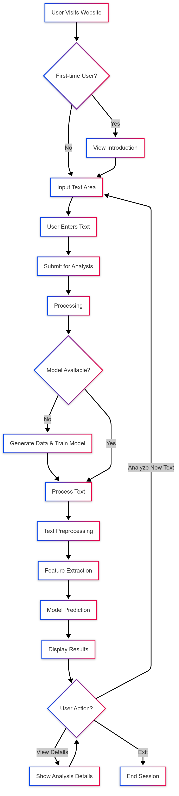

# PeaceKeeper: AI-Powered Stress Detection System

PeaceKeeper is an AI-powered stress detection system that analyzes text input to identify stress levels in users. The system uses natural language processing (NLP), sentiment analysis, and machine learning techniques to detect whether a user's text indicates **low**, **medium**, or **high** stress levels — and provides personalized suggestions for stress management.

---

## 🚀 Features

- **Text-Based Stress Detection**: Classifies input as low, medium, or high stress.
- **Hybrid NLP Engine**:
  - VADER sentiment analysis + emoji-aware sentiment scoring.
  - Negation-aware keyword detection for better nuance.
- **Real Data Integration**: Currently uses annotated Reddit data for model training.
- **Class Balancing**: Automatically balances data for fair model performance across stress levels.
- **Synthetic Dataset Generator**: Optionally create realistic data for testing or bootstrapping.
- **Stress Projection**: (Optional) Visualizes potential stress trends over time.
- **Responsive Web UI**: Real-time feedback on stress levels through a sleek frontend.
- **Personalized Suggestions**: Mental health resources and coping strategies per stress level.

---

## 🗂 Screenshots

  


---

## 💻 System Requirements

- Python 3.8+
- TensorFlow 2.x
- Flask
- Pandas, NumPy, Matplotlib
- scikit-learn
- NLTK (punkt, stopwords, wordnet, vader_lexicon)

---

## ⚙️ Installation

```bash
git clone https://github.com/your-username/peacekeeper.git
cd peacekeeper
python -m venv venv
# On Windows:
venv\Scripts\activate
# On macOS/Linux:
source venv/bin/activate
pip install -r requirements.txt
python -c "import nltk; nltk.download('punkt'); nltk.download('stopwords'); nltk.download('wordnet'); nltk.download('vader_lexicon')"
```

---

## 🧠 Training the Model

**Make sure you've placed `your_dataset.csv` in your `data/` directory.**

Then run:
```bash
python main.py --preprocess --train
```

This will:
- Preprocess all available data (e.g., Reddit posts).
- Balance and encode stress levels (low, medium, high).
- Train the neural network using LSTM (or other model defined in config).

---

## ⚙️ Running the App

```bash
python app.py
```

```CMD
# if error try:
set FLASK_APP=app.py
set FLASK_ENV=development
flask run
```

Then visit:
```
http://127.0.0.1:5000/
```

Enter text → Click **Analyze** → Get immediate stress detection and suggestions.

---

## ⚙️ Configuration

Settings are managed through `config.json`, including:

- `max_features`, `maxlen`, `embedding_dims`
- LSTM/Transformer model type
- Class imbalance thresholds
- Training hyperparameters (`epochs`, `batch_size`, etc.)
- Stress keyword weights and rules

---

## 🧪 Testing the Model

```bash
python test_model.py
```

This evaluates the trained model and displays metrics like accuracy and F1-score.

---

## 🛠 Analyzing Sample Text

Analyze a custom sentence:

```bash
python main.py --text "I'm having a calm and productive day."
```

Or test with built-in samples:

```bash
python main.py --analyze
```

---

## 🗃️ Data & Schema

- `your_dataset.csv`: Your primary dataset
- `processed_data/`: Contains cleaned and labeled training data
- `models/`: Trained model `.h5` files, logs, and checkpoints

---

---

## 🗃️ User Flowchart

  

---
